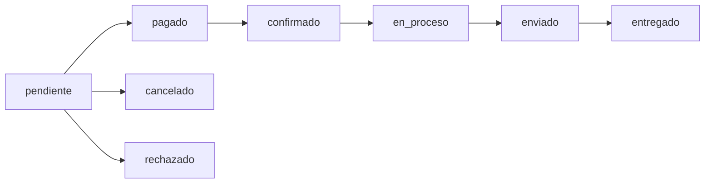

Manage customer orders from payment confirmation through fulfillment and delivery. Track order status, update shipping information, and handle order processing workflows.

## Overview

The order management system provides complete visibility into customer orders, including payment status via Flow integration, order details, and fulfillment tracking.

<Warning>
  All order management operations require:
  - Valid JWT authentication token
  - User role must be `admin`
  - Both `requireAuth` and `requireAdmin` middleware
</Warning>

## Order Schema

Orders are stored in the `pedidos` table with comprehensive payment and fulfillment tracking:

| Field | Type | Description |
|-------|------|-------------|
| `id` | SERIAL | Primary key |
| `usuario_id` | INTEGER | User ID (nullable for guest checkout) |
| `comprador_nombre` | VARCHAR(255) | Buyer's name (required) |
| `comprador_email` | VARCHAR(255) | Buyer's email (required) |
| `comprador_telefono` | VARCHAR(20) | Buyer's phone |
| `direccion_envio` | TEXT | Shipping address (required) |
| `total` | DECIMAL(10,2) | Order total amount |
| `costo_envio` | DECIMAL(10,2) | Shipping cost (default: 3500) |
| `notas` | TEXT | Customer notes |
| `estado` | VARCHAR(30) | Order status |
| `commerce_order` | VARCHAR(255) | Unique order ID sent to Flow |
| `flow_order` | VARCHAR(255) | Flow's order ID |
| `flow_token` | VARCHAR(255) | Flow transaction token |
| `flow_status` | INTEGER | Flow payment status code |
| `flow_payment_data` | JSONB | Complete Flow payment data |
| `metodo_pago` | VARCHAR(50) | Payment method (default: flow) |
| `created_at` | TIMESTAMP | Order creation time |
| `updated_at` | TIMESTAMP | Last update time |
| `fecha_pago` | TIMESTAMP | Payment confirmation time |
| `fecha_envio` | TIMESTAMP | Shipping date |
| `fecha_entrega` | TIMESTAMP | Delivery date |

## Order Status Flow

Orders progress through defined states from creation to delivery:



### Available Status Values

Defined in `backend/schema.sql:90-101`:

| Status | Description | When to Use |
|--------|-------------|-------------|
| `pendiente` | Created, awaiting payment | Initial order state |
| `pagado` | Payment confirmed | After Flow payment success |
| `confirmado` | Order confirmed by admin | Admin acknowledges order |
| `en_proceso` | In preparation | Order is being prepared |
| `enviado` | Shipped to customer | Order dispatched |
| `entregado` | Delivered | Customer received order |
| `cancelado` | Cancelled | Order cancelled |
| `rechazado` | Payment rejected | Flow payment failed |

<Note>
  Status values are stored in lowercase and validated via database CHECK constraint.
</Note>

## Managing Orders

### Viewing All Orders

<Steps>
  <Step title="Fetch order list">
    Call `GET /admin/pedidos` to retrieve all orders with user information.

    ```javascript
    const { data } = await api.get("/admin/pedidos");
    ```
  </Step>

  <Step title="Display order details">
    Orders are returned with joined user data from the `usuarios` table.

    ```json
    [
      {
        "id": 42,
        "usuario_id": 5,
        "usuario_nombre": "Juan Pérez",
        "usuario_email": "juan@example.com",
        "comprador_nombre": "Juan Pérez",
        "comprador_email": "juan@example.com",
        "direccion_envio": "Av. Principal 123, Santiago",
        "total": 25990,
        "costo_envio": 3500,
        "estado": "pagado",
        "commerce_order": "BMS-1234567890",
        "flow_order": "987654321",
        "metodo_pago": "flow",
        "created_at": "2026-03-13T10:30:00Z"
      }
    ]
    ```
  </Step>
</Steps>

Implemented in `backend/controllers/adminController.js:27-41`:

```javascript
exports.getAllOrders = async (req, res) => {
    const result = await pool.query(`
        SELECT p.*, u.nombre AS usuario_nombre, u.email AS usuario_email
        FROM pedidos p
        LEFT JOIN usuarios u ON p.usuario_id = u.id
        ORDER BY p.created_at DESC
    `);
    res.json(result.rows);
};
```

### Updating Order Status

<Steps>
  <Step title="Select order">
    Identify the order to update from the orders list.

    ```javascript
    const orderId = 42;
    ```
  </Step>

  <Step title="Choose new status">
    Select the appropriate next status based on order progression.

    ```javascript
    const newStatus = "confirmado";
    ```
  </Step>

  <Step title="Submit status update">
    Call the update endpoint with the new status.

    ```javascript
    await api.put(`/admin/pedidos/${orderId}/estado`, {
      estado: newStatus
    });
    ```
  </Step>

  <Step title="Update UI optimistically">
    Update local state immediately for better UX.

    ```javascript
    setOrders(prev =>
      prev.map(o =>
        o.id === orderId ? { ...o, estado: newStatus } : o
      )
    );
    ```
  </Step>
</Steps>

Implemented in `backend/controllers/adminController.js:43-58`:

```javascript
exports.updateOrderStatus = async (req, res) => {
    const { id } = req.params;
    const { estado } = req.body;

    await pool.query(
        `UPDATE pedidos SET estado = $1 WHERE id = $2`,
        [estado, id]
    );

    res.json({ ok: true });
};
```

<Warning>
  Status updates are immediate and affect customer notifications. Ensure you select the correct status before updating.
</Warning>

## Order Items

Each order contains line items stored in the `pedido_items` table:

```sql
CREATE TABLE pedido_items (
  id SERIAL PRIMARY KEY,
  pedido_id INTEGER NOT NULL REFERENCES pedidos(id) ON DELETE CASCADE,
  producto_id INTEGER REFERENCES productos(id) ON DELETE SET NULL,
  producto_titulo VARCHAR(200) NOT NULL,
  producto_imagen VARCHAR(500),
  cantidad INTEGER NOT NULL CHECK (cantidad > 0),
  precio_unitario DECIMAL(10,2) NOT NULL,
  subtotal DECIMAL(10,2) NOT NULL,
  created_at TIMESTAMP DEFAULT CURRENT_TIMESTAMP
);
```

### Key Features

- **Product snapshots**: Item details are stored at purchase time
- **Soft references**: Products can be deleted without breaking order history
- **Automatic cleanup**: Items deleted when parent order is deleted
- **Quantity validation**: CHECK constraint ensures positive quantities

## Flow Payment Integration

Orders are integrated with Flow payment gateway for processing Chilean payments.

### Payment Fields

| Field | Purpose |
|-------|----------|
| `commerce_order` | Your unique order ID sent to Flow |
| `flow_order` | Flow's internal order reference |
| `flow_token` | Transaction token for verification |
| `flow_status` | Flow status code (1=pending, 2=paid, 3=rejected, 4=cancelled) |
| `flow_payment_data` | Complete JSONB payment response from Flow |

### Payment Status Codes

- `1` - Pending payment
- `2` - Payment successful
- `3` - Payment rejected
- `4` - Payment cancelled

<Note>
  When Flow confirms payment (status 2), update order status to `pagado` and set `fecha_pago` timestamp.
</Note>

## Using the useOrders Hook

The frontend provides a React hook for order management:

```javascript
import useOrders from "../hooks/useOrders";

function OrderManagement() {
  const {
    orders,
    loading,
    error,
    fetchOrders,
    updateOrderStatus
  } = useOrders();

  const handleStatusChange = async (orderId, newStatus) => {
    const success = await updateOrderStatus(orderId, newStatus);
    if (success) {
      console.log("Order updated successfully");
    }
  };
}
```

### Hook API

| Property/Method | Type | Description |
|----------------|------|-------------|
| `orders` | Array | All orders with user data |
| `loading` | Boolean | Loading state |
| `error` | String | Error message if any |
| `fetchOrders` | Function | Refresh order list |
| `updateOrderStatus` | Function | Update order status (orderId, newStatus) |

Implemented in `frontend/src/admin/hooks/useOrders.js`.

### Status Update with Optimistic UI

The hook implements optimistic updates for better UX:

```javascript
const updateOrderStatus = async (orderId, newStatus) => {
  try {
    // Optimistic update
    setOrders(prev =>
      prev.map(o =>
        o.id === orderId ? { ...o, estado: normalizedNewStatus } : o
      )
    );

    // API call
    await api.put(
      `/admin/pedidos/${orderId}/estado`,
      { estado: normalizedNewStatus }
    );

    return true;
  } catch (err) {
    // Revert on error
    fetchOrders();
    return false;
  }
};
```

## Webhook Logging

Flow payment webhooks are logged in the `flow_webhooks` table for auditing:

```sql
CREATE TABLE flow_webhooks (
  id SERIAL PRIMARY KEY,
  pedido_id INTEGER REFERENCES pedidos(id) ON DELETE CASCADE,
  token VARCHAR(255) NOT NULL,
  flow_order VARCHAR(255),
  flow_status INTEGER,
  request_body JSONB NOT NULL,
  request_headers JSONB,
  processed BOOLEAN DEFAULT false,
  processing_error TEXT,
  ip_origen VARCHAR(45),
  created_at TIMESTAMP DEFAULT CURRENT_TIMESTAMP
);
```

This provides complete audit trail of all payment notifications.

## API Endpoints Summary

### GET /admin/pedidos

Retrieve all orders with user information.

**Route:** `backend/routes/admin.js:50-55`

**Headers:**
```
Authorization: Bearer <jwt_token>
```

**Response:** `200 OK`
```json
[
  {
    "id": 42,
    "usuario_nombre": "Juan Pérez",
    "usuario_email": "juan@example.com",
    "comprador_nombre": "Juan Pérez",
    "total": 25990,
    "estado": "pagado",
    "created_at": "2026-03-13T10:30:00Z"
  }
]
```

**Status Codes:**
- `200` - Successfully retrieved orders
- `401` - Unauthorized (missing or invalid token)
- `403` - Forbidden (user is not admin)
- `500` - Server error

### PUT /admin/pedidos/:id/estado

Update order status.

**Route:** `backend/routes/admin.js:57-62`

**Parameters:**
- `id` - Order ID

**Headers:**
```
Authorization: Bearer <jwt_token>
```

**Body:**
```json
{
  "estado": "confirmado"
}
```

**Response:** `200 OK`
```json
{
  "ok": true
}
```

**Status Codes:**
- `200` - Status updated successfully
- `401` - Unauthorized
- `403` - Forbidden (not admin)
- `500` - Server error

<Warning>
  Status must be one of the valid values defined in the database CHECK constraint. Invalid status values will be rejected.
</Warning>

## Order Processing Workflow

<Steps>
  <Step title="New order received">
    Order is created with status `pendiente`. Customer is redirected to Flow payment.
  </Step>

  <Step title="Payment confirmation">
    Flow webhook updates order to `pagado` and stores payment data. Set `fecha_pago` timestamp.
  </Step>

  <Step title="Admin confirms order">
    Admin reviews paid orders and updates status to `confirmado`.
  </Step>

  <Step title="Prepare order">
    Update status to `en_proceso` when beginning order preparation.
  </Step>

  <Step title="Ship order">
    Update status to `enviado` when order is dispatched. Set `fecha_envio` timestamp.
  </Step>

  <Step title="Delivery confirmation">
    Update status to `entregado` when customer receives order. Set `fecha_entrega` timestamp.
  </Step>
</Steps>

## Best Practices

1. **Check payment status** before confirming orders
2. **Update status promptly** to keep customers informed
3. **Record timestamps** for shipping and delivery
4. **Monitor Flow webhooks** for payment issues
5. **Handle guest orders** (orders with null `usuario_id`)
6. **Preserve order history** - never hard delete orders

<Note>
  The `updated_at` timestamp is automatically updated via database trigger when order status changes.
</Note>

## Next Steps

<CardGroup cols={2}>
  <Card title="Dashboard" icon="chart-line" href="/admin/dashboard">
    View order statistics and metrics
  </Card>
  <Card title="User Management" icon="users" href="/admin/user-management">
    Manage customer accounts
  </Card>
</CardGroup>