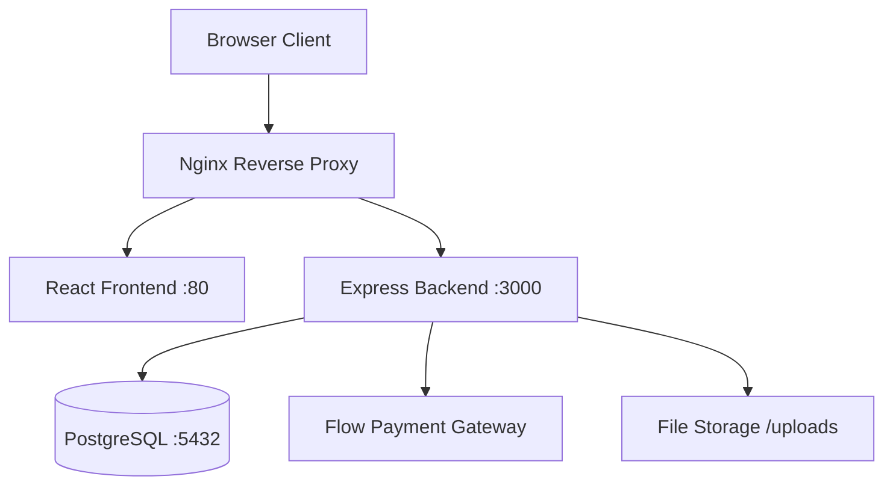
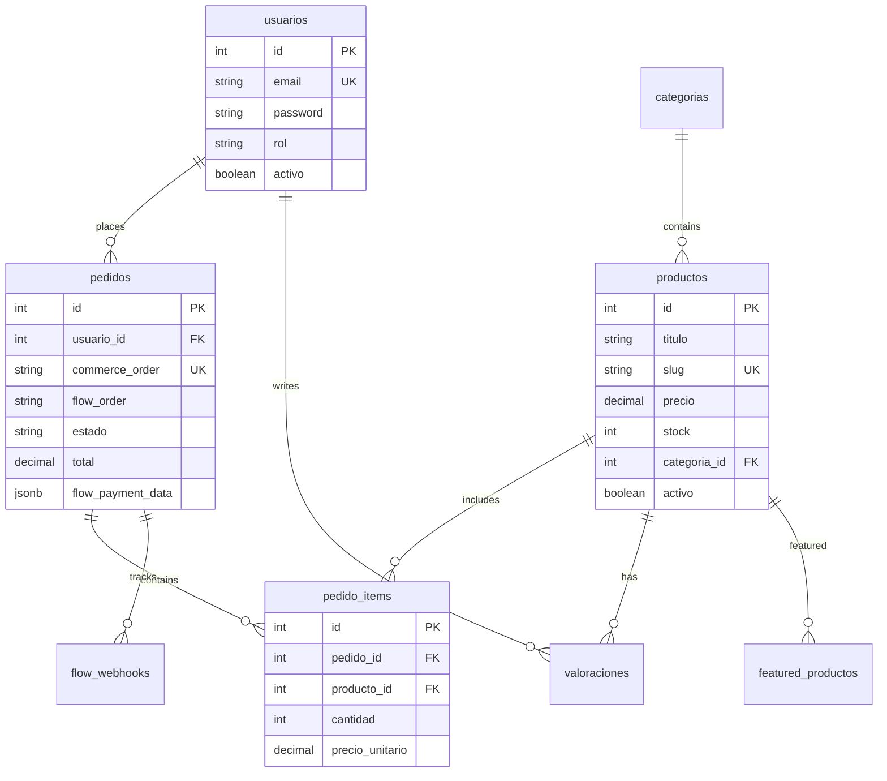
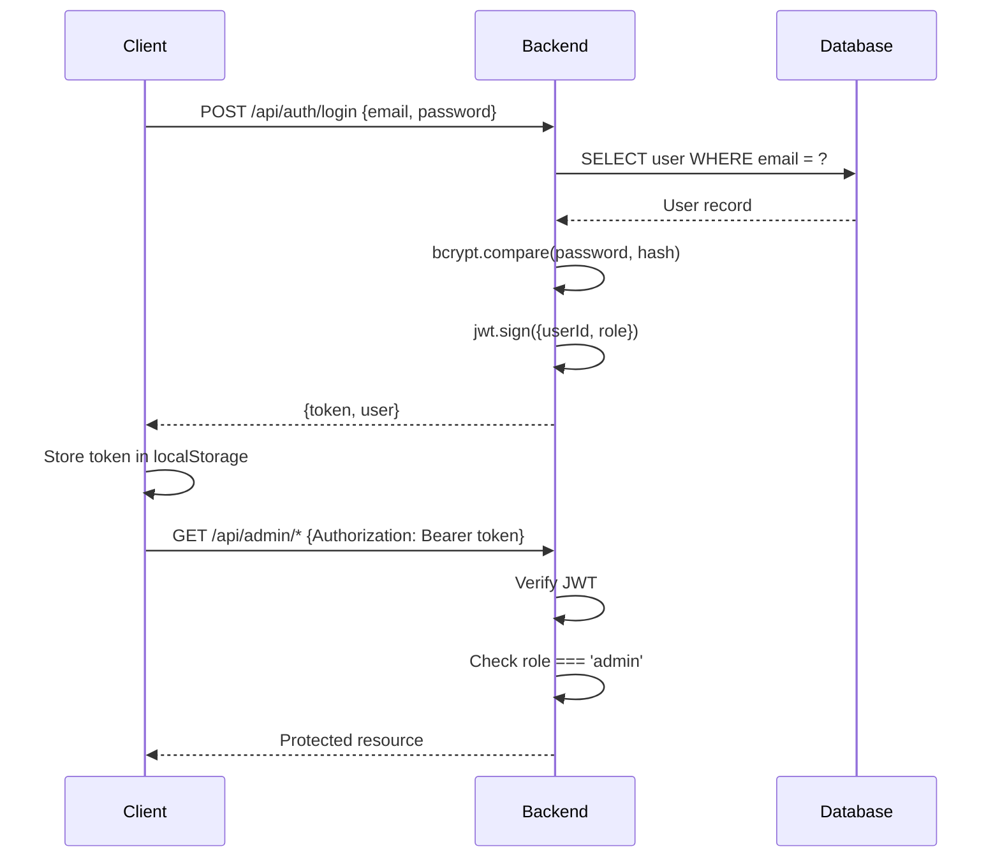

# System Architecture

Black Michi Studio follows a modern three-tier architecture with a React frontend, Node.js/Express backend, and PostgreSQL database. The system is containerized using Docker and can be deployed as a complete stack.

## Architecture Overview



<CardGroup cols={3}>
  <Card title="Frontend" icon="browser">
    React 18 + Vite + Tailwind CSS
  </Card>
  <Card title="Backend" icon="server">
    Node.js + Express + PostgreSQL
  </Card>
  <Card title="Infrastructure" icon="docker">
    Docker + Nginx + Flow Gateway
  </Card>
</CardGroup>

---

## Frontend Architecture

The frontend is a modern React application built with Vite for fast development and optimized production builds.

### Tech Stack

<CodeGroup>

```json Core Dependencies
{
  "react": "^18.2.0",
  "react-dom": "^18.2.0",
  "react-router-dom": "^6.30.1",
  "vite": "^7.1.7"
}
```

```json UI & Styling
{
  "tailwindcss": "^3.4.17",
  "lucide-react": "^0.544.0",
  "swiper": "^12.0.2"
}
```

```json Utilities
{
  "axios": "^1.12.2",
  "html2canvas": "^1.4.1",
  "jspdf": "^4.0.0"
}
```

</CodeGroup>

### Directory Structure

```bash
frontend/src/
├── admin/              # Admin dashboard components
├── api/                # API client configuration
├── components/         # Reusable UI components
│   ├── CategoryCards/
│   ├── Header/
│   ├── Footer/
│   ├── HeroSection/
│   ├── LazyImage/
│   └── PopularProducts/
├── contexts/           # React contexts
│   ├── AuthContext.jsx
│   └── CartContext.jsx
├── hooks/              # Custom React hooks
├── pages/              # Route-level components
│   ├── Home.jsx
│   ├── ProductList.jsx
│   ├── ProductDetail.jsx
│   ├── Cart.jsx
│   ├── Checkout.jsx
│   └── PaymentReturn.jsx
├── routes/             # Route configuration
├── services/           # Business logic services
├── user/               # User-specific components
├── utils/              # Utility functions
└── main.jsx           # Application entry point
```

### Key Features

<Tabs>
  <Tab title="Routing">
    React Router v6 with declarative routing:

    ```jsx
    import { BrowserRouter } from "react-router-dom";
    import AppRoutes from "./routes/AppRoutes";

    // Routes include:
    // - / (Home)
    // - /products (Product List)
    // - /product/:id (Product Detail)
    // - /cart (Shopping Cart)
    // - /checkout (Checkout)
    // - /admin/* (Admin Dashboard)
    ```
  </Tab>

  <Tab title="State Management">
    Context API for global state:

    ```jsx
    // AuthContext - User authentication state
    <AuthProvider>
      // Provides: user, login, logout, isAuthenticated
    </AuthProvider>

    // CartContext - Shopping cart state
    <CartProvider>
      // Provides: cart, addToCart, removeFromCart, clearCart
    </CartProvider>
    ```
  </Tab>

  <Tab title="Image Optimization">
    Custom lazy loading with intersection observer:

    ```jsx
    import { initHoverImageLoading, initIntersectionObserver } from "./utils/lazyImageLoader";

    // Initialize on app load
    initHoverImageLoading();
    initIntersectionObserver();
    ```
  </Tab>
</Tabs>

---

## Backend Architecture

The backend is a RESTful API built with Express.js, providing endpoints for products, orders, authentication, and payment processing.

### Tech Stack

<CodeGroup>

```json Core Dependencies
{
  "express": "^4.22.1",
  "pg": "^8.16.3",
  "dotenv": "^16.4.5",
  "cors": "^2.8.6",
  "compression": "^1.7.4"
}
```

```json Authentication
{
  "bcrypt": "^6.0.0",
  "jsonwebtoken": "^9.0.2",
  "google-auth-library": "^10.5.0"
}
```

```json File Handling
{
  "multer": "^2.0.2",
  "sharp": "^0.34.5"
}
```

</CodeGroup>

### Directory Structure

```bash
backend/
├── controllers/        # Request handlers
├── middleware/         # Express middleware
│   ├── auth.js        # JWT authentication
│   └── upload.js      # File upload (Multer)
├── routes/            # API route definitions
│   ├── auth.js        # Authentication endpoints
│   ├── productos.js   # Product CRUD
│   ├── categorias.js  # Category management
│   ├── payments.js    # Flow payment integration
│   ├── admin.js       # Admin operations
│   ├── client.js      # Client operations
│   └── reviews.js     # Product reviews
├── services/          # Business logic
│   └── flowService.js # Flow API integration
├── lib/               # Utilities
│   ├── db.js         # PostgreSQL connection pool
│   └── keepAlive.js  # Render.com keep-alive
├── uploads/          # User-uploaded files
└── index.js          # Application entry point
```

### API Endpoints

<Accordion title="Product Endpoints">

```javascript
// Public Routes
GET    /api/productos          # Get all products
GET    /api/productos/:id      # Get product by ID

// Admin Routes (requires authentication + admin role)
POST   /api/productos          # Create product
PUT    /api/productos/:id      # Update product
DELETE /api/productos/:id      # Delete product
```

Example from `backend/routes/productos.js:14-15`:
```javascript
router.get("/", productosController.getAllProducts);
router.get("/:id", productosController.getProductById);
```

</Accordion>

<Accordion title="Payment Endpoints">

```javascript
// Flow Payment Gateway Integration
POST /api/payments/flow/create        # Create payment
GET  /api/payments/flow/return        # Payment return URL
POST /api/payments/flow/confirmation  # Webhook from Flow
GET  /api/payments/pedido/:id/status  # Get order status
```

Example from `backend/routes/payments.js:10`:
```javascript
router.post('/flow/create', async (req, res) => {
  const { items, total, email, nombre, notas, telefono, direccion } = req.body;
  // Creates order and redirects to Flow payment page
});
```

</Accordion>

<Accordion title="Authentication Endpoints">

```javascript
POST /api/auth/login       # User login
POST /api/auth/register    # User registration
POST /api/auth/google      # Google OAuth login
GET  /api/auth/verify      # Verify JWT token
```

</Accordion>

<Accordion title="Admin Endpoints">

```javascript
// All require: requireAuth + requireAdmin middleware
GET    /api/admin/dashboard      # Admin statistics
GET    /api/admin/orders         # All orders
PUT    /api/admin/orders/:id     # Update order status
POST   /api/admin/hero-images    # Update hero images
```

</Accordion>

### Middleware Stack

The backend uses several middleware layers:

<Steps>

<Step title="CORS Configuration">

From `backend/index.js:61-80`:

```javascript
app.use((req, res, next) => {
  const origin = req.headers.origin || '*';
  res.setHeader('Access-Control-Allow-Origin', origin);
  res.setHeader('Access-Control-Allow-Credentials', 'true');
  res.setHeader('Access-Control-Allow-Methods', 'GET, POST, PUT, DELETE, PATCH, OPTIONS, HEAD');
  res.setHeader('Access-Control-Allow-Headers', 'Origin, X-Requested-With, Content-Type, Accept, Authorization');
  
  if (req.method === 'OPTIONS') {
    return res.sendStatus(200);
  }
  next();
});
```

</Step>

<Step title="Compression & Caching">

From `backend/index.js:86-107`:

```javascript
// GZIP compression for responses > 1KB
app.use(compression({
  level: 6,
  threshold: 1024
}));

// Cache headers
app.use((req, res, next) => {
  // Images: 30 days
  if (req.path.match(/\.(webp|jpg|jpeg|png|gif|svg)$/i)) {
    res.setHeader('Cache-Control', 'public, max-age=2592000, immutable');
  }
  // Bundles: 1 year
  else if (req.path.match(/\.[a-f0-9]{8}\.(js|css)$/)) {
    res.setHeader('Cache-Control', 'public, max-age=31536000, immutable');
  }
  next();
});
```

</Step>

<Step title="Authentication">

```javascript
const { requireAuth, requireAdmin } = require('./middleware/auth');

// Protected routes
app.use('/api/client', requireAuth, clientRoutes);
app.use('/api/admin', requireAuth, requireAdmin, adminRoutes);
```

</Step>

</Steps>

---

## Database Architecture

PostgreSQL 16 provides the data layer with a comprehensive schema designed for e-commerce operations.

### Entity Relationship Diagram



### Core Tables

<Tabs>
  <Tab title="usuarios">
    User accounts with role-based access control.

    ```sql
    CREATE TABLE usuarios (
      id SERIAL PRIMARY KEY,
      nombre VARCHAR(100) NOT NULL,
      email VARCHAR(100) NOT NULL UNIQUE,
      password VARCHAR(255) NOT NULL,
      rol VARCHAR(20) DEFAULT 'cliente' CHECK (rol IN ('admin', 'cliente')),
      telefono VARCHAR(20),
      direccion TEXT,
      email_verified BOOLEAN DEFAULT false,
      activo BOOLEAN DEFAULT true,
      created_at TIMESTAMP DEFAULT CURRENT_TIMESTAMP,
      updated_at TIMESTAMP DEFAULT CURRENT_TIMESTAMP
    );
    ```

    **Roles**: `admin` (full access) or `cliente` (customer)
  </Tab>

  <Tab title="productos">
    Product catalog with pricing, stock, and category relationships.

    ```sql
    CREATE TABLE productos (
      id SERIAL PRIMARY KEY,
      titulo VARCHAR(200) NOT NULL,
      slug VARCHAR(200) UNIQUE,
      precio DECIMAL(10,2) NOT NULL,
      precio_anterior DECIMAL(10,2),
      descripcion TEXT,
      descuento_porcentaje DECIMAL(5,2),
      imagen_principal VARCHAR(500) NOT NULL,
      imagenes_adicionales TEXT[],
      categoria_id INTEGER REFERENCES categorias(id),
      stock INTEGER DEFAULT 5,
      activo BOOLEAN DEFAULT true,
      created_at TIMESTAMP DEFAULT CURRENT_TIMESTAMP
    );
    ```

    **Features**: Automatic slug generation, discount calculations, multi-image support
  </Tab>

  <Tab title="pedidos">
    Orders with Flow payment integration.

    ```sql
    CREATE TABLE pedidos (
      id SERIAL PRIMARY KEY,
      usuario_id INTEGER REFERENCES usuarios(id),
      comprador_nombre VARCHAR(255) NOT NULL,
      comprador_email VARCHAR(255) NOT NULL,
      direccion_envio TEXT NOT NULL,
      total DECIMAL(10,2) NOT NULL,
      estado VARCHAR(30) DEFAULT 'pendiente',
      commerce_order VARCHAR(255) UNIQUE NOT NULL,
      flow_order VARCHAR(255),
      flow_token VARCHAR(255),
      flow_status INTEGER,
      flow_payment_data JSONB,
      created_at TIMESTAMP DEFAULT CURRENT_TIMESTAMP
    );
    ```

    **Order States**: `pendiente`, `pagado`, `confirmado`, `en_proceso`, `enviado`, `entregado`, `cancelado`, `rechazado`
  </Tab>

  <Tab title="pedido_items">
    Order line items preserving product details at purchase time.

    ```sql
    CREATE TABLE pedido_items (
      id SERIAL PRIMARY KEY,
      pedido_id INTEGER NOT NULL REFERENCES pedidos(id) ON DELETE CASCADE,
      producto_id INTEGER REFERENCES productos(id),
      producto_titulo VARCHAR(200) NOT NULL,
      producto_imagen VARCHAR(500),
      cantidad INTEGER NOT NULL,
      precio_unitario DECIMAL(10,2) NOT NULL,
      subtotal DECIMAL(10,2) NOT NULL
    );
    ```

    **Note**: Product details are denormalized to preserve historical accuracy
  </Tab>
</Tabs>

### Optimizations

<CodeGroup>

```sql Indexes
-- Order lookups
CREATE INDEX idx_pedidos_usuario_id ON pedidos(usuario_id);
CREATE INDEX idx_pedidos_estado ON pedidos(estado);
CREATE INDEX idx_pedidos_commerce_order ON pedidos(commerce_order);
CREATE INDEX idx_pedidos_created_at ON pedidos(created_at DESC);

-- Product queries
CREATE INDEX idx_productos_categoria ON productos(categoria_id);
CREATE INDEX idx_productos_activo ON productos(activo);
```

```sql Triggers
-- Auto-update timestamps
CREATE OR REPLACE FUNCTION update_updated_at_column()
RETURNS TRIGGER AS $$
BEGIN
    NEW.updated_at = CURRENT_TIMESTAMP;
    RETURN NEW;
END;
$$ language 'plpgsql';

CREATE TRIGGER update_productos_updated_at 
  BEFORE UPDATE ON productos
  FOR EACH ROW EXECUTE FUNCTION update_updated_at_column();
```

</CodeGroup>

---

## Payment Integration

Black Michi Studio integrates with Flow, a Chilean payment gateway, for processing transactions.

### Payment Flow

<Steps>

<Step title="Create Order">

Client calls `POST /api/payments/flow/create` with cart data:

```javascript
const response = await axios.post('/api/payments/flow/create', {
  items: cart,
  total: 15990,
  email: 'customer@example.com',
  nombre: 'Juan Pérez',
  direccion: 'Calle Falsa 123, Santiago'
});

// Response includes Flow payment URL
window.location.href = response.data.paymentUrl;
```

</Step>

<Step title="Process Payment">

User is redirected to Flow's secure payment page. After completion, Flow redirects back to:

```
GET /api/payments/flow/return?token=ABC123
```

Backend redirects to frontend:

```
https://frontend.com/payment/return?token=ABC123&pedidoId=456
```

</Step>

<Step title="Webhook Confirmation">

Flow sends a webhook to confirm payment status:

```javascript
POST /api/payments/flow/confirmation
{
  token: 'ABC123'
}
```

From `backend/routes/payments.js:265-384`, the webhook handler:
- Validates the signature
- Gets payment status from Flow
- Updates order in database
- Decrements product stock on successful payment
- Logs the webhook for audit trail

</Step>

</Steps>

### Stock Management

Automatic stock deduction on successful payment (from `backend/routes/payments.js:355-384`):

```javascript
if (payment.status === 2) { // Payment successful
  const items = await db.query(
    'SELECT producto_id, cantidad FROM pedido_items WHERE pedido_id = $1',
    [pedido.id]
  );

  for (const item of items.rows) {
    await db.query(
      'UPDATE productos SET stock = stock - $1 WHERE id = $2 AND stock >= $3',
      [item.cantidad, item.producto_id, item.cantidad]
    );
  }
}
```

---

## Docker Infrastructure

The application is containerized for consistent deployment across environments.

### Docker Compose Stack

From `docker-compose.yml:1-75`:

```yaml
version: "3.9"

services:
  frontend:
    build: ./frontend
    expose:
      - "80"
    depends_on:
      - backend

  backend:
    build: ./backend
    environment:
      - DB_HOST=db
      - DB_PORT=5432
      - DB_NAME=blackmichiestudio
    expose:
      - "3000"
    depends_on:
      db:
        condition: service_healthy

  db:
    image: postgres:16-alpine
    environment:
      POSTGRES_DB: blackmichiestudio
      POSTGRES_USER: postgres
      POSTGRES_PASSWORD: hola123
    healthcheck:
      test: ["CMD-SHELL", "pg_isready -U postgres"]
      interval: 5s
      timeout: 5s
      retries: 10
    volumes:
      - pgdata:/var/lib/postgresql/data

  nginx:
    image: nginx:stable-alpine
    depends_on:
      - frontend
      - backend
    ports:
      - "80:80"
    volumes:
      - ./nginx/nginx.conf:/etc/nginx/nginx.conf:ro

volumes:
  pgdata:
```

### Multi-Stage Builds

<Tabs>
  <Tab title="Backend Dockerfile">
    From `backend/Dockerfile:1-30`:

    ```dockerfile
    # Build stage with native dependencies
    FROM node:20-alpine AS builder
    RUN apk add --no-cache python3 make g++
    WORKDIR /app
    COPY package*.json ./
    RUN npm ci --omit=dev

    # Runtime stage
    FROM node:20-alpine
    WORKDIR /app
    RUN apk add --no-cache vips-dev
    COPY --from=builder /app/node_modules ./node_modules
    COPY . .
    EXPOSE 10000
    CMD ["node", "index.js"]
    ```

    **Optimizations**: Multi-stage build reduces final image size, Alpine Linux for minimal footprint
  </Tab>

  <Tab title="Frontend Dockerfile">
    From `frontend/Dockerfile:1-18`:

    ```dockerfile
    # Build stage
    FROM node:20-alpine AS build
    WORKDIR /app
    COPY package*.json ./
    RUN npm ci
    COPY . .
    RUN npm run build

    # Runtime with Nginx
    FROM nginx:stable-alpine AS runtime
    COPY nginx.conf /etc/nginx/conf.d/default.conf
    COPY --from=build /app/dist /usr/share/nginx/html
    EXPOSE 80
    CMD ["nginx", "-g", "daemon off;"]
    ```

    **Optimizations**: Static build served by Nginx for optimal performance
  </Tab>
</Tabs>

---

## Security Considerations

<Warning>
**Production Security Checklist**:
- Change all default passwords (database, admin users)
- Use strong JWT secrets
- Enable HTTPS/TLS with valid certificates
- Validate Flow webhook signatures in production
- Set secure CORS origins (not wildcard)
- Use environment variables for all secrets
- Enable PostgreSQL SSL connections
- Implement rate limiting on API endpoints
</Warning>

### Authentication Flow



---

## Performance Optimizations

<CardGroup cols={2}>
  <Card title="Backend" icon="gauge-high">
    - GZIP compression on responses
    - Static file caching (30 days for images)
    - Database connection pooling
    - Image optimization with Sharp
    - Response caching headers
  </Card>

  <Card title="Frontend" icon="bolt">
    - Vite for fast builds
    - Lazy image loading
    - Code splitting
    - Intersection Observer API
    - Optimized bundle sizes
  </Card>
</CardGroup>

---

## Deployment

The application is designed for easy deployment to various platforms:

<Tabs>
  <Tab title="Docker Compose">
    ```bash
    # Production deployment
    docker-compose -f docker-compose.prod.yml up -d
    ```
  </Tab>

  <Tab title="Render.com">
    - Backend: Node.js service
    - Frontend: Static site
    - Database: PostgreSQL instance
    - Includes keep-alive functionality for free tier
  </Tab>

  <Tab title="VPS/Server">
    - Clone repository
    - Configure environment variables
    - Run `docker-compose up -d`
    - Configure reverse proxy (Nginx/Caddy)
    - Set up SSL certificates
  </Tab>
</Tabs>

---

## Monitoring & Logging

The backend includes comprehensive logging:

```javascript
// Health check endpoint
GET /health
// Returns: uptime, memory usage, status

// Database connection test
GET /test-db
// Returns: connection status, configuration

// Request logging
app.use((req, res, next) => {
  console.log(`[${new Date().toISOString()}] ${req.method} ${req.url}`);
  next();
});
```

<Note>
**Webhook Audit Trail**: All Flow payment webhooks are logged in the `flow_webhooks` table for debugging and compliance.
</Note>

---

## Scalability Considerations

For scaling Black Michi Studio:

1. **Database**: Use read replicas for read-heavy operations
2. **File Storage**: Move uploads to S3/CloudFlare R2
3. **Caching**: Add Redis for session storage and API caching
4. **Load Balancing**: Add multiple backend instances behind a load balancer
5. **CDN**: Serve static assets through a CDN
6. **Queue System**: Use Bull/BullMQ for background jobs (email, image processing)

---

## Next Steps

<CardGroup cols={2}>
  <Card title="API Reference" icon="code">
    Explore detailed API endpoint documentation
  </Card>
  <Card title="Customization" icon="paintbrush">
    Learn how to customize themes and components
  </Card>
  <Card title="Deployment Guide" icon="rocket">
    Deploy to production environments
  </Card>
  <Card title="Contributing" icon="users">
    Guidelines for contributing to the project
  </Card>
</CardGroup>